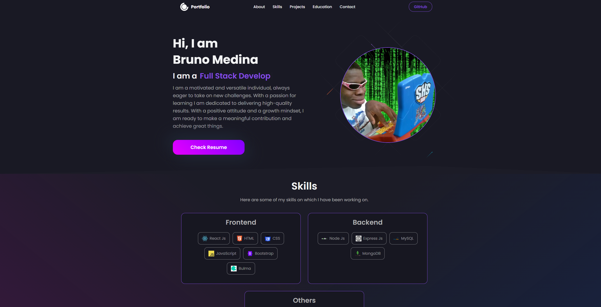

# My React Portfolio

Welcome to my React Portfolio! This project is a showcase of my skills and projects as a web developer. It provides a glimpse into my journey, expertise, and the various applications I've built using React.

## Table of Contents

- [Introduction](#introduction)
- [Getting Started](#getting-started)
  - [Deployment](#deployment)
  - [Dependencies](#dependencies)
- [User Experience](#user-experience)
  - [Header](#header)
  - [Navigation](#navigation)
  - [Sections](#sections)
    - [About Me](#about-me)
    - [Portfolio](#portfolio)
    - [Contact](#contact)
    - [Resume](#resume)
  - [Footer](#footer)
- [Customization](#customization)
- [Development](#development)
- [Deployment](#deployment-1)
- [Acknowledgments](#acknowledgments)



## Introduction

As a passionate web developer, I've created this React Portfolio to provide a seamless and informative experience for anyone interested in exploring my work. This portfolio reflects my dedication to staying current with the latest technologies while showcasing the projects that define my skill set.

## Getting Started

### Deployment

To view my portfolio, visit [Netlify](#) and explore the various sections that highlight my journey and expertise.

### Dependencies

If you'd like to explore the code and run the portfolio locally, make sure to install the necessary dependencies by running:

```bash
npm install
```

## User Experience

### Header

The header presents my name prominently, ensuring a personal touch to the overall experience.

### Navigation

The navigation bar contains titles corresponding to different sections of the portfolio, including:
- About Me
- Portfolio
- Contact
- Resume

Clicking on a navigation title smoothly transitions to the corresponding section without reloading the page.

### Sections

#### About Me

In this section, you'll find a recent photo or avatar of mine, accompanied by a short bio. It's a personal introduction to who I am and what drives my passion for web development.

#### Portfolio

The portfolio section showcases titled images of six of my applications. Each project includes links to both the deployed applications and their corresponding GitHub repositories, offering a comprehensive overview of my work.

#### Contact

This section features a contact form with fields for your name, email address, and a message. User-friendly notifications guide you through the form interaction, ensuring a smooth communication process.

#### Resume

In the resume section, you'll find a link to download my resume, along with a list of my proficiencies as a web developer.

### Footer

The footer contains text or icon links to my GitHub and LinkedIn profiles, as well as a link to another platform where you can find more about me (Stack Overflow, Twitter, etc.).

## Customization

Feel free to customize this portfolio to fit your personal style and preferences. Add additional features, tweak the design, or include new sections that better represent your unique journey and skills.

## Development

If you wish to contribute or explore the code further, follow standard development practices. Ensure thorough testing and adherence to best coding practices.

## Deployment

Once satisfied with your personalized portfolio, deploy it to Netlify or your preferred hosting service. Share the link with potential employers, collaborators, and the broader developer community.

## Acknowledgments

Special thanks to the React community for their continuous support and the inspiration that fuels my passion for web development.

Thank you for visiting my React Portfolio! I hope you enjoy exploring my projects and learning more about my journey in the world of web development.